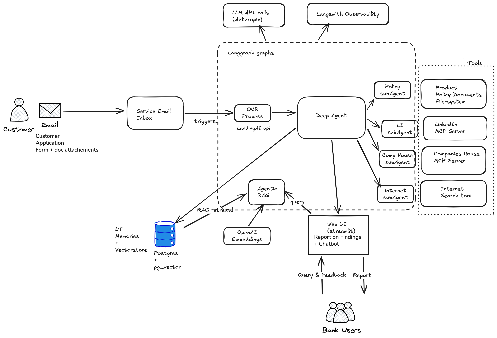
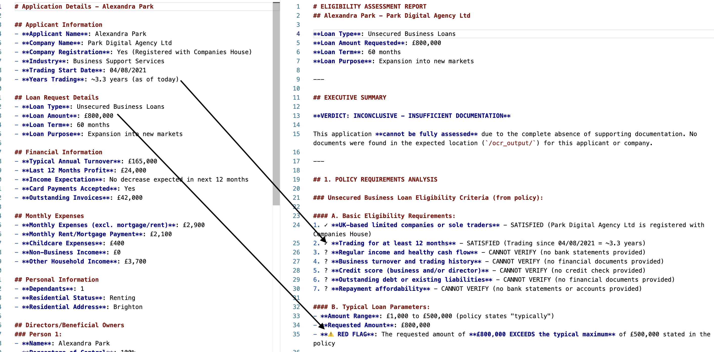

# Fionaa  (FInancial ONline  loan Application Assessment)

By Steve Goodman

## Task 1: Defining Problem, Audience, and Scope

### Problem
Business loans require loan applicants to submit quite a lot of paperwork (more so than for consumer loans) about their business  to convince lenders that the business and business owners are legitimate, the information supplied is accurate, and the business is financially heathy enough to lend money to. 

Bank statements, company annual accounts (10 K in the US), identity documents are minimum requirements, but there are potentially quite a few others required depending on the type of business and loan required, File formats and document format/ content of each document may vary. In addition, the lender will conduct its own independent due-diligence from multiple online sources.  

### Audience 
Bank employees who conduct this work are Financial Advisers, Relationship Managers or Credit Brokers with subject matter expertise. Human evaluation of this data and compiling a report (for passing to the next stage of the process) currently takes more than 1 hour per application, which is significant considering only a small fraction of those applications convert to a loan, and therefore make the bank money. A genuine ask when I worked for a bank about 1.5 years ago, was to find opportunities to automate some of the process in order to reduce the time required to review. At that time, there were 30+ employees in the (relatively small) bank who carry out these activities. It should be noted that the objective is not to replace these people or reduce the number of staff -  their main functions is  sales and their targets are tied to how many sales (converted loans) they make. So the purpose is to assist them move faster so that they can spend more of their time on the things that matter.

### Scope
For this Certification Challenge, I'm using only publicly available data sources, so it will exclude some typical due diligence activities such as credit reference checks or criminal checks or using detailed internal bank policy documents that are not in the public domain.

The inputs to the application being proposed are using some of my own data (from my own private limited company, now dissolved) including annual reports/accounting information and bank statements to vibe check the results of the app. However, documents like personal identity documents are not included for obvious reasons, plus a theoretical loan application containing my details.

As output I'd expect an assessment of whether those documents meet the minimum criteria to pass the checks, and I'd expect any automated checks to contain a faithful representation of the documents submitted or any public information retrieved from the internet to be attributed to my company and be accurate.

## Task 2 - Solution
Introducing FIONAA - an AI-powered app that automates part of the back office process of evaluating business loan applications and report writing.

FIONAA seeks to reduce that manual labour and shorten the human review time by automatically extracting and assessing key information from the submitted documents
	• conducting online searches of publicly available data
	•  cross-referencing this data for (in)consistencies
	•  then compiling this information into a report. 
	
A large UK bank who have implemented such a system claim to have reduced human review time by 98% : https://medium.com/ai-at-lloyds-banking-group/commercial-real-estate-artificial-intelligence-transforming-schedule-processing-with-generative-ai-fb3721920a0f  I'm not quite as bullish as these claims(it would take me longer than the claimed 2 minutes just to review the final AI-generated report), so I'd thing a more conservative 50% reduction is achievable.

### Why AI?
Its wise to consider whether the automation we desire could be done via more conventional means without use of AI. On the surface, the overall process for each loan application is the same, and the output (a report) is the same or has the same structural elements. However, there are many 'it depends' kinds of questions along the way. 

For example, my bank offers 20+ different kinds of business loans to cover various business scenarios and therefore the bank will require different documents, or will look at different aspects of a companies financial position depending on the purpose and type of loan, and the amount of money required. The process also depends  company's legal status, e.g.  incorporated companies are handled very different to sole traders (where focus is more on the individual rather than the corporation).
.
All this to say, it would be hard to encode the business logic for all permutations up front, programmatically, so there needs to be some flexibility in making decisions on the fly when presented with a novel scenario. 

### Key design decisions

**Technology choices** - Develop local first, but design with a view to using one of the 2 cloud stacks (GCP and AWS) we use, and align with our bank's existing internal tooling (Gsuite, Postgres, Anthropic, Langchain), and minimise  wherever possible, the use of new 3rd party tools and callouts (mindful of the fact this is a heavily regulated industry, so adding new tools is a compliance/governance challenge)

	a.  LLMs  - Claude, Sonnet for planning/coordinating tasks and the eligibility sub agent (complex reasoning), Haiku for other subagents , because widely used already in our bank, and arguably the best.  Landing.AI for OCR and document extraction (tried GCPs version of DocumentAI - performed poorly on the first set documents submitted)

	b.  Agent Frameworks - Langgraph with the deep agent framework doing most of the tasks - wanted to use the Memory Store and File system tools, and context isolation for the research tasks which are quite intensive, and there is quite a lot of reasoning happening.
	
    c.  Tools - MCPs for wrapping Companies House and Linked-In apis, and Tavily for general web search. MCP for quick/easy integration - Companies House has 37 endpoints.
	
    d.  Embedding Models - openai small for the Chatbot RAG. Small, inexpensive.
	
    e.  Vector database - pg_vector extension to Postgres, also using Postgres for the Memory Store. Our company uses Postgres extensively, as does Langsmith cloud (my next step for deployment)
	
    f.  Monitoring - Langsmith because of ease of integration of existing langgraph ecosystem, and next steps are to deploy the graph to Langsmith cloud anyway, so leveraging that subscription.
	
    g.  Evals - RAGAS for RAG evaluation, but hand crafted for some agent evals. RAGAS Agent evals didn't have what I needed out of the box
	
    h.  UI - Streamlit - simple and quick to build for demo purposes.
	
    i.   Deployment - currently local with Langgraph dev, but a Langsmith/GCP hosted version coming soon, since many of the tools used above are built on the GCP stack and it is a provider used by our bank.
	
    j.  Other -  Gmail API to accept applications, parse contents, and trigger Langgraph graphs. A likely prod deployment will integrate with CRM systems (Salesforce) but this was an acceptable alternative for a demo. Note, in reality we do accept some loan applications via gmail.
	

**User Experience-** I have observed at first hand in our bank that AI projects that add to the user's cognitive load or introduces additional friction in any way, was an impediment to adoption. Therefore the pattern for this app follows what Langchain call an Ambient Agent - the process it is triggered automatically and runs in the background, so the results are ready and waiting whenever the user chooses to view. There is no perceived latency from their POV even though the process itself takes 5+ minutes to execute. 

**Human in the loop-** we want automation, but also allow the user the opportunity to provide feedback that changes the reports, if they disagree with the automated output, because our users are subject matter experts and ultimately have accountability for the output. I have created a Web-based UI  for demo purposes to view and query the output of the AI process and be able to change findings as they see fit ( In production, its more likely that such a UI would be deployed by integrating it within an existing CRM system, Salesforce, than as a stand-alone application.)

**Application Flow:**

	1. The process is triggered by the customer sending their application with document attachments (Bank statements etc) to the banks email account for loan applications.

	2. Receipt of that email triggers a Langgraph graph to execute. I am using Gmail APIs  to get email and parse body and attachments, then insert them into the main graph and trigger its execution. 

	3. The first node in the graph, the OCR node, parses the document attachments, classifies them by type (is it a bank statement, id document, something else?) and extracts key information from them, and stores them to disk.

	4. Flow passes to the 2nd node in the graph, which is a deep agent framework that has subagents with tools to check the application against policy documents (stored in filesystem that agent has read access to) and internet searches via some specialist MCP tools.

	5. Report is generated, and persisted to memory store. User can view final report +  all customer submitted documents through an application UI

	6. A chatbot feature (separate Agentic RAG graph) so that users can query those documents or request changes to final report if something doesn't look right. The vector store for RAG and the reports themselves are persisted in Postgres.

## Task 3: Dealing with the Data

### Data Sources

	• A completed loan application form (simulated data for this demo). 

	• Private documents consisting of Company's Annual Report, and multiple bank statements from same period. I have tried bank statements from a couple of different banks to check the OCR is reliable.

	• Loan policy documentation - determines the application requirements for a particular type of loan. Scraped from bank's public  webpages.

	• API calls to Companies House, Linked-In and web-search - to retrieve publicly available information about a company and its directors. 
	
The main graph in this system - the ambient agent - does not use RAG, although RAG is used in the 2nd graph (the chatbot that users can interact with). However, the main graph does have several retrieval elements:

	1. Policy sub-agent - searches over internal policy documentation to test if the users application meets the eligibility rules - however, given the nature of these documents (1 page per loan type), does not in my opinion make RAG the suitable choice, so I'm using file system for storage of documents, that are loaded dynamically by the agent. Part of the eligibility assessment is to determine what documentation the applicant needs to provide to prove their application is legitimate. This agent interacts with the other sub-agents below because it needs information from them to see proof of documentation and that they're genuinely registered at Companies House. 

	2. Search over Companies House, linked-in and public internet search - to retrieve information about registered companies and their directors, linked-in pages,  press stories or company web-pages.

	3. Document extraction - involves use of OCR parsing, document classification (determining if read document is a bank statement, 10k, personal id), and knowledge extraction (key pieces of information requested for each document category are correctly extracted).

The ambient agent is designed to answer questions such as

	• Does it meet basic eligibility requirements according to the loan policy documents? 
	• Are all documents required by those policy documents attached to the application (e.g. history of bank statements stretching back 6 or 12 months with no gaps?)
	• Is information on application form consistent with supplied documentation?
	• Is it consistent with publicly available information about the company?
	• Does company or its directors have a web presence (linked-in page, website)?

### RAG chatbot 
 I expect that most of the key knowledge will be reported on by the ambient agent, but the lending team's Product Manager did ask a relevant question:
	 "What happens if I have a question that’s not answered in the generated report?"

This is why I built this additional RAG chatbot. For example to query longer documents like the annual company reports (which can run to 100s of pages for larger companies), or business plans. I've used OpenAI text embeddings small, with a default chunk size of 500, without any optimisation.

Since my personal company reports are short and very brief (legal exemption for small companies), instead I've used a report  from Synthesia - a well-known generative AI startup ( 60 + pages) for evaluation purposes.

## Task 4: Building an End-to-End Agentic RAG Prototype

https://www.loom.com/share/b4d363a93ff344a0b711cfc75a6268b1

## Task 5: Evals

As discussed in Task 3, the main ambient agent doesn't make use of RAG, but instead would require a battery of tests to ensure the various sub-agents are working reliably. Its not my intention to cover all of these in this assignment, as its an extensive undertaking (see for example https://blog.langchain.com/evaluating-deep-agents-our-learnings/), and would require a combination of human evaluation, custom evals, tool calling evaluation, on each of these. 

Instead I will cover some aspects of the Policy Sub-agent and then the Chatbot component that uses RAG to fulfil the requirements of this section.

For the Policy Sub-agent I've created a test set via an LLM to generate 20 fictitious loan applications from fictitious companies. However, since we cannot supply the appropriate documentation with their application (like bank statements), some of the checks will fail, so Out of-the-box automated checks like 'Agent Goal Accuracy', will not help here since  none of the examples will pass due to lack of above documents. 

Therefore, I'll vibe-check the other requirements apart from documentary evidence to determine if the agent correctly reason over the fictitious application answers in the test data, against the bank's loan policies. Here is an example of an application alongside the check - in this case it passes the vibe check because it can correctly identify that Years Trading meets the minimum policy requirements, but loan amount requested exceeds the maximum set by the policy.

Assessment 18 / 20 examples were correct. There were 2 questionable decisions that the agent marked as uncertain. One of which was whether location==Dublin meets the UK eligibility requirement (it clearly does not).

What I have anecdotally observed , when running checks through the entire ambient agent pipeline, is that internet searches or linked in searches don't always return the correct company or correct director when running my own details through, since there are many companies and company directors that share my name or a close approximation to it. So this is an area for improvement.

### Chatbot RAG
I've created a test set for the RAG component of my app. Created a synthetic dataset of questions and answers using Ragas SGD with 20 examples generated from the Company Annual Report for Synthesia (62 pages).
From RAGAS metrics the results are:

<table border="1" class="dataframe">
  <thead>
    <tr style="text-align: right;">
      <th></th>
      <th>context_precision</th>
      <th>context_recall</th>
      <th>faithfulness</th>
      <th>factual_correctness(mode=f1)</th>
      <th>context_entity_recall</th>
    </tr>
  </thead>
  <tbody>
    <tr>
      <th>naive_retriever</th>
      <td>0.7167</td>
      <td>0.875</td>
      <td>0.7461</td>
      <td>0.5055</td>
      <td>0.5713</td>
    </tr>
   
  </tbody>
</table>

Its not wise to draw too many conclusions looking at the absolute numbers given there is nothing compare to - see next task, but factual correctness  would be a bit of concern.

## Task 6: Improving the Prototype

For this improvement I've implemented a hybrid dense + sparse retriever. The intuition is that there maybe some patterns of queries in a looking at a financial report that might benefit from a lexical search, and we see the use of this search as a way of quick fact-based answers to basic questions, rather than complex abstract ones (the other part of the application is more concerned with providing analysis of broader or more abstract concepts). For example questions in the Synthetic data set include 'what was the loss in 2023?' 'what was consolidated revenue…as of 31 Dec 2023' are reasonable questions that could be answered by lexical search.

<table border="1" class="dataframe">
  <thead>
    <tr style="text-align: right;">
      <th></th>
      <th>context_precision</th>
      <th>context_recall</th>
      <th>faithfulness</th>
      <th>factual_correctness(mode=f1)</th>
      <th>context_entity_recall</th>
    </tr>
  </thead>
  <tbody>
    <tr>
      <th>naive_retriever</th>
      <td>0.7167</td>
      <td>0.875</td>
      <td>0.7461</td>
      <td>0.5055</td>
      <td>0.5713</td>
    </tr>
    <tr>
      <th>sparse_and_dense_retriever</th>
      <td>0.4853</td>
      <td>0.950</td>
      <td>0.7922</td>
      <td>0.6755</td>
      <td>0.5595</td>
    </tr>
  </tbody>
</table>

Dense retriever has higher context precision (0.72). It returns fewer irrelevant chunks, but also misses more relevant ones.

Hybrid "Sparse and dense" retriever has lower precision (more chunks retrieved, more noise) but much higher recall. The model appears to handle the extra context well, since faithfulness and factual correctness improve.

Hybrid  retriever is the better choice for this setup, it returns in more relevant chunks, which leads to more faithful and factually correct answers. The lower precision is acceptable if the model can effectively use and filter the extra context.

## Task 7: Next Steps
For demo-day there are few changes I propose to work on to improve the app, time and task might dictate which ones get completed or dropped.
	• App hardening and migration to GCP with Security. Started this process already migrating MCP Servers to GCP Cloud Run
	• Task 5 showed that for Chatbot RAG, a hybrid retriever was superior, so will change the app to use that.
	• Improve user trust - through guardrails and providing grounded answers via citation links. 
	• Feedback loops. Take the user feedback and use it to update episodic memory, so that the applications report writing improves over time to the user preferences.

I will close by saying that in moving from prototype to production, there are some parts of the process that are deterministic and would work more reliably by being hard-coded rather than LLM generated and require guardrails and the like to provide that reliability. 

### Acknowledgements
All content above was self-written, with no AI used.
Source code was mostly self-written with agent coding assistance for front-end, refactoring, debugging. Gmail integration taken from code by Langchain.com, MCPs were existing open-source implementations, bounding-box drawing taken from code from landing.ai

